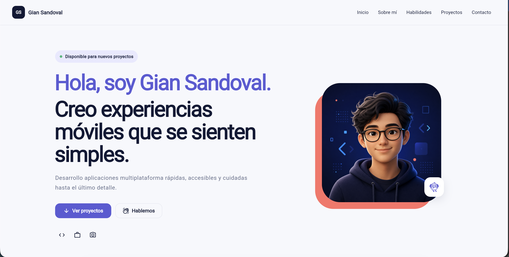

# Plantilla de portafolio Flutter

Una plantilla responsive y fácil de editar para el workshop. Funciona en web,
Android, iOS y escritorio con una sola base de código.



## Personalízala en 3 pasos

1. Abre `lib/config/portfolio_config.dart`.
2. Cambia tu nombre, descripción, correo, redes, habilidades y proyectos.
3. Reemplaza `assets/images/profile.png` por tu foto (mantén el mismo nombre).

Eso es todo. No necesitas tocar los widgets para usar la plantilla.

## Ejecutar el proyecto

```bash
flutter pub get
flutter run -d chrome
```

Para comprobar que todo está correcto:

```bash
flutter analyze
flutter test
```

## Estructura

```text
lib/
├── config/
│   └── portfolio_config.dart    # Toda tu información editable
├── core/
│   ├── theme/                   # Colores y estilos globales
│   └── utils/                   # Apertura segura de enlaces
├── features/portfolio/
│   ├── portfolio_page.dart
│   └── widgets/                 # Secciones reutilizables
├── models/                      # Modelos de proyectos, redes y habilidades
├── app.dart
└── main.dart
```

## Consejos para el workshop

- Usa una imagen cuadrada para `profile.png` (por ejemplo, 800 × 800 px).
- Escribe las URLs completas, incluyendo `https://`.
- Para el correo solo cambia `email`; la plantilla crea el enlace `mailto:`.
- Puedes agregar o quitar elementos de las listas `projects`, `skillGroups`,
  `stats` y `socials`.
- Para cambiar la identidad visual edita `AppColors` en
  `lib/core/theme/app_theme.dart`.

## Diseño responsive

- Móvil: menú compacto y tarjetas en una columna.
- Tablet: tarjetas en dos columnas.
- Escritorio: navegación completa y grillas de tres columnas.

La imagen incluida es un placeholder generado para la plantilla y está pensada
para ser reemplazada por cada participante.

## Licencia

Este proyecto se distribuye bajo la [Licencia MIT](LICENSE). Puedes usarlo,
modificarlo y compartirlo libremente conservando el aviso de licencia.
